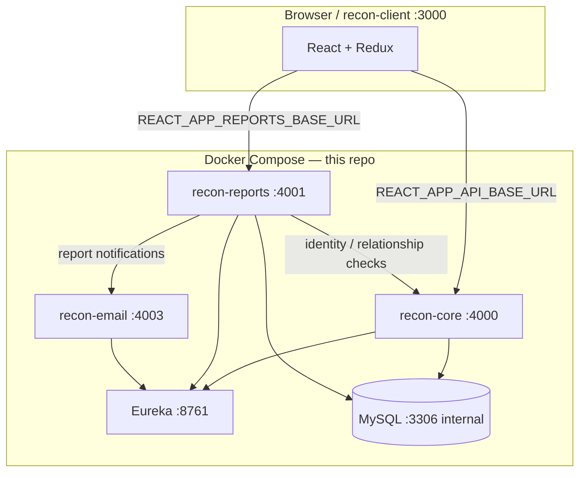

# Recon

Recon is a training-reporting application for **contractors**, **trainees**, and **schools**. Contractors submit weekly reports for linked trainees; schools read **finalized** reports; trainees can add a **retort** after finalization. This repository holds the **Java/Spring Boot** microservices and Docker Compose stack. The **React** client lives in a sibling repo and can be started via a Compose overlay.

## What this demonstrates

- **Microservice boundaries** — core (`reconV2`), reports (`recon-report-service`), email (`recon-email-service`), discovery (`recon-discovery-service`)
- **Service discovery** — Netflix Eureka; services register at startup
- **Shared MySQL** — schema and seed data applied on first Docker volume create
- **JWT authentication** — login and refresh on core; report APIs require `Authorization` and verify relationships via core
- **Split API origins in the UI** — main API (`:4000`) vs reports API (`:4001`) via `REACT_APP_*` in the client
- **Docker Compose local stack** — health-gated startup (`depends_on: service_healthy`)
- **Domain rules in code and tests** — draft vs school-visible reports; retort after finalize (`ReportRetortVisibilityIntegrationTest`)
- **End-to-end smoke** — Playwright walkthrough against Docker backends (client repo)
- **AWS touchpoints** — S3 profile pictures (core), SES email (email service); local Docker uses placeholder credentials

## Architecture

### Backend modules

| Directory | Compose service | Responsibility |
|-----------|-----------------|----------------|
| `recon-discovery-service` | `eureka` | Eureka server |
| `reconV2` | `recon-core` | Auth, profiles, contractor/trainee/school APIs, S3 bucket routes, JWT verification helpers |
| `recon-report-service` | `recon-reports` | Weekly reports, finalize, retort, school portal reads |
| `recon-email-service` | `recon-email` | Outbound email (Amazon SES) |

### Runtime (local Docker)

The browser talks to the React dev server on port **3000** (fullstack overlay only). The client calls **core** for auth and profile data and **reports** for report CRUD and listings. JVM services register with **Eureka** and use **MySQL** on the internal Docker network. The report service validates JWTs and contractor/trainee/school relationships by calling core over HTTP.

### Frontend

React (Create React App) source: **`../MERN/Recon/recon-client`** by default. Override with `RECON_CLIENT_CONTEXT` in `.env`. API bases are set at build/dev time in `src/Utilities/URLs.js` (`REACT_APP_API_BASE_URL`, `REACT_APP_REPORTS_BASE_URL`).

### Diagram



More detail: [docs/local-dev-setup.md](docs/local-dev-setup.md).

## Local run (Docker Compose)

**Requirements:** Docker and Docker Compose. For the full stack, check out `recon-client` at `RECON_CLIENT_CONTEXT` (default `../MERN/Recon/recon-client`).

**Backend only:**

```bash
docker compose up --build
```

**Backend + React dev server:**

```bash
docker compose -f docker-compose.yaml -f docker-compose.fullstack.yml up --build
```

Open http://localhost:3000. The UI calls APIs on host-mapped **4000** and **4001**.

**Stop:**

```bash
docker compose down
# fullstack:
docker compose -f docker-compose.yaml -f docker-compose.fullstack.yml down
```

**Reset database** (re-run init SQL; wipes the named volume):

```bash
docker compose down -v && docker compose up --build
```

**Seeded users** (password: `password`):

| Role | Email |
|------|-------|
| Contractor | `contractor.1@yahoo.com` |
| Trainee | `trainee.1@yahoo.com` |
| School | `school.1@yahoo.com` |

**Client without Docker:** from `recon-client`, `npm start` with `.env.development.local` pointing at `http://localhost:4000` and `http://localhost:4001` (see client README).

## Services and ports

Host ports come from root [`.env`](.env) (`RECON_*_HOST_PORT` / `RECON_*_APP_PORT`).

| Service | Compose name | Host port | Notes |
|---------|--------------|-----------|--------|
| MySQL | `mysql` | *(not published)* | Internal `:3306`; `RECON_MYSQL_HOST_PORT=0` |
| Eureka | `eureka` | 8761 | Service discovery |
| Core API | `recon-core` | 4000 | Auth, profile, connections |
| Reports API | `recon-reports` | 4001 | Reports, finalize, retort |
| Email API | `recon-email` | 4003 | SES-backed email |
| React (overlay) | `recon-client` | 3000 | Only with `docker-compose.fullstack.yml` |

## Health checks

Compose defines probes so dependent services start in order:

| Service | Check |
|---------|--------|
| `mysql` | `mysqladmin ping` |
| `eureka`, `recon-core`, `recon-reports`, `recon-email` | `GET /actuator/health` on container `APP_PORT` |

`recon-core`, `recon-reports`, and `recon-email` wait for healthy **Eureka** and **MySQL**. The fullstack overlay waits for healthy **recon-core** and **recon-reports** before starting `recon-client` (no health probe on the client container).

**Manual checks:**

```bash
curl http://localhost:4000/actuator/health
curl http://localhost:4001/actuator/health
curl http://localhost:4003/actuator/health
curl http://localhost:8761/actuator/health
curl http://localhost:4000/user/test
```

## Validated flows

| Flow | Validation |
|------|------------|
| Core reachable | `GET /user/test` |
| Contractor login | `POST /user/authenticate/contractor` (see [local-dev-setup](docs/local-dev-setup.md)) |
| Actuator health | curl on 4000, 4001, 4003, 8761 |
| UI login (contractor, school, trainee) → `/home` | Playwright: `recon-client/e2e/docker-backend-smoke.spec.js` |
| Profile and trainee connections (contractor) | Same smoke spec |
| Report year picker (contractor) | Same smoke spec |
| Draft hidden from school until finalized; retort rules | `ReportRetortVisibilityIntegrationTest` in `recon-report-service` |
| Finalize / retort service logic | `ReportServiceImplTest` |
| Login UI screenshots | Playwright `e2e/visual.spec.js` (client repo) |

**Smoke (API)** — with stack up, see [docs/local-dev-setup.md](docs/local-dev-setup.md).

**Smoke (UI + Docker backends)** — from `recon-client`:

```bash
PLAYWRIGHT_SKIP_WEB_SERVER=1 PLAYWRIGHT_BASE_URL=http://localhost:3000 \
  npx playwright test e2e/docker-backend-smoke.spec.js
```

**Report integration test** — from `recon-report-service`:

```bash
./mvnw -Dtest=ReportRetortVisibilityIntegrationTest test
```

## Architecture Tradeoffs

This project intentionally favors **local development simplicity** over production-grade distributed-system complexity: a shared MySQL database, synchronous service-to-service calls without a retry layer, and Docker Compose scoped to local demos—not a production deployment blueprint.

For an honest breakdown of scope, current architecture, known tradeoffs, and sensible hardening follow-ups, see [docs/architecture-tradeoffs.md](docs/architecture-tradeoffs.md).

## Engineering decisions

- **Two repositories** — backend portfolio here; UI in `recon-client`, wired by `RECON_CLIENT_CONTEXT` and `docker-compose.fullstack.yml`.
- **Core vs report service** — separates auth/profile from report persistence; the UI uses two base URLs. Reports trust core for identity and contractor–trainee–school relationships instead of duplicating that logic.
- **Eureka** — standard Spring Cloud registration; Compose uses healthchecks so clients start after discovery and MySQL are ready.
- **Single MySQL database** — shared `recon` schema; init scripts run only when the `recon-mysql-data` volume is first created. (ideally want 1 db instance per MS, but choosing simplicity here)
- **Optional config server import** — core declares `spring.config.import=optional:configserver:...` against the Eureka host; report service keeps that import commented out.
- **Finalization and retort** — school-facing queries filter on `isFinalized`; retort is a separate one-to-one entity, covered by integration tests.

## Next improvements

Documented gaps and follow-ups already in the repo:

- **Local dev:** `/bucket/picture` needs real S3 credentials; UI falls back to a default avatar ([local-dev-setup](docs/local-dev-setup.md)).
- **Local dev:** report month/week dropdowns depend on selecting a year first (cascade UX).
- **Local dev:** missing `Authorization` on report APIs returns 500, not 401.
- **UI backlog:** structured tasks in [docs/architecture/recon-client-ui-roadmap.md](docs/architecture/recon-client-ui-roadmap.md) (tooling, routing, layout).
- **Testing:** broaden backend automated coverage; add a backend CI script comparable to the client’s `lint` / `test:ci` contract.

## Related docs

- [docs/architecture-tradeoffs.md](docs/architecture-tradeoffs.md) — scope, architecture, known tradeoffs, production hardening ideas
- [docs/local-dev-setup.md](docs/local-dev-setup.md) — service map, env files, curl examples
- [recon-client README](../MERN/Recon/recon-client/README.md) — Node version, `REACT_APP_*`, Playwright visual tests
