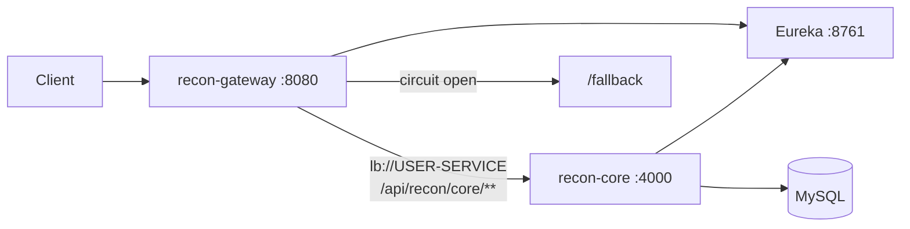

# Recon API Gateway Integration

This document describes the introduction of `recon-gateway`, a Spring Cloud Gateway microservice, and the supporting changes in Eureka and recon-core (`reconV2`) that enable gateway routing, resilience patterns, and local development without Docker-only environment variables.

**Branch:** `feature/recon-gateway-ms` → PR into `dockerized`

---

## Summary

| Area | Change |
|------|--------|
| **New service** | `recon-gateway` — reactive API gateway with Eureka discovery, circuit breaker, retry, and request logging |
| **Eureka** | Default port fallback when `APP_PORT` is unset (`8761`) |
| **recon-core** | Local-dev env defaults, Lombok build fix, permissive test endpoints for gateway resilience experiments |
| **Docker Compose** | Not updated in this PR — gateway runs standalone for now |

---

## New Service: `recon-gateway`

### Purpose

`recon-gateway` is the single HTTP entry point for routing client traffic to backend services registered in Eureka. It demonstrates:

- **Service discovery routing** via `lb://USER-SERVICE`
- **Circuit breaking** (Resilience4j) with a local fallback
- **Retry** with exponential backoff for flaky downstream paths
- **Per-route timeouts** overriding global HTTP client settings
- **Structured request/response logging** via a global filter

### Technology Stack

| Component | Version |
|-----------|---------|
| Spring Boot | 3.0.5 |
| Spring Cloud | 2022.0.5 |
| Java | 17 |
| Gateway | Spring Cloud Gateway (WebFlux) |
| Resilience | `spring-cloud-starter-circuitbreaker-reactor-resilience4j` |

### Key Files

| File | Role |
|------|------|
| `RouteLocatorConfig.java` | Defines routes, filters (strip prefix, circuit breaker, retry), and per-route timeouts |
| `GatewayRequestLoggingFilter.java` | Global filter logging inbound/outbound requests with timing |
| `FallbackController.java` | Returns `"Fallback"` when the recon-core circuit breaker opens |
| `GatewayDiscoveryConfiguration.java` | Enables Eureka client (`@EnableDiscoveryClient`) |
| `application.properties` | Port, Eureka URL, circuit breaker tuning, global HTTP timeouts |

### Routes

Gateway listens on port **8080** by default (`RECON_GATEWAY` env var).

| Route ID | Path pattern | Backend | Filters |
|----------|--------------|---------|---------|
| `recon-core-ms` | `/api/recon/core/**` | `lb://USER-SERVICE` | Strip 3 path segments, circuit breaker → `/fallback` |
| `recon-core-ms-retry` | `/api/recon/core/user/test/flaky/**` | `lb://USER-SERVICE` | Strip 3 path segments, retry (3x on 500, backoff) |
| Demo routes | `/get`, `/gets`, `*.circuitbreaker.com` | `httpbin.org` | Learning/examples (can be removed later) |

#### Path rewriting example

A request to:

```
GET http://localhost:8080/api/recon/core/user/test
```

is stripped of `/api/recon/core` and forwarded to recon-core as:

```
GET http://user-service:4000/user/test
```

`USER-SERVICE` is the Eureka registration name for recon-core (`spring.application.name=user-service` in reconV2).

### Resilience Configuration

**Circuit breaker** (`recon-core-ms` instance):

- COUNT_BASED sliding window, size 5
- Opens at 50% failure rate after 5 calls
- 10s wait in open state, 2 calls permitted in half-open
- Time limiter: 10s

**Global HTTP client** (gateway level):

- Connect timeout: 1000ms (`RECON_GATEWAY_CONNECTION_TIMEOUT`)
- Response timeout: 3s (`RECON_GATEWAY_SERVICE_RESPONSE_TIMEOUT`)

**Per-route overrides** (recon-core routes):

- Connect timeout: 10s
- Response timeout: 5s

> **Note:** Resilience4j TimeLimiter wraps the downstream call. The effective timeout hierarchy is documented in `application.properties` comments.

### Running Locally

Prerequisites: Eureka on 8761, recon-core on 4000 (both can use the new default env fallbacks).

```bash
# 1. Start Eureka
cd recon-discovery-service && ./mvnw spring-boot:run

# 2. Start recon-core (MySQL required for full app; test endpoints work without DB for basic checks)
cd reconV2 && ./mvnw spring-boot:run

# 3. Start gateway
cd recon-gateway && ./mvnw spring-boot:run
```

Verify:

```bash
# Direct recon-core
curl http://localhost:4000/user/test

# Via gateway
curl http://localhost:8080/api/recon/core/user/test

# Circuit breaker fallback (after repeated failures to /user/test/internal-error)
curl http://localhost:8080/api/recon/core/user/test/internal-error
```

Actuator endpoints: `health`, `info`, `gateway` (route inspection).

---

## Eureka Changes (`recon-discovery-service`)

**File:** `src/main/resources/application.yml`

```yaml
server:
  port: ${APP_PORT:8761}
```

**Why:** Allows running Eureka locally without setting `APP_PORT` in the environment. Docker Compose continues to set `APP_PORT` via `env/recon-eureka.env`, so container behavior is unchanged.

---

## recon-core Changes (`reconV2`)

### Local development defaults

**File:** `src/main/resources/application.properties`

| Property | Before | After |
|----------|--------|-------|
| Eureka URL | `http://${EUREKA_SERVICE_NAME}:8761/eureka` | `http://${EUREKA_SERVICE_NAME:localhost}:8761/eureka` |
| Server port | `${APP_PORT}` | `${APP_PORT:4000}` |
| Config server | `http://${EUREKA_SERVICE_NAME}:8761` | `http://${EUREKA_SERVICE_NAME:localhost}:8761` |
| MySQL URL | `jdbc:mysql://${MYSQL_SERVICE_NAME}:3306/recon` | `jdbc:mysql://${MYSQL_SERVICE_NAME:localhost}:3306/recon` |

**Why:** recon-core can start outside Docker Compose with sensible localhost defaults, matching the gateway/Eureka local-dev workflow.

### Security: test endpoint wildcard

**File:** `SecurityConfig.java`

```java
.antMatchers(..., "/user/test/**", ...)
```

Previously only `/user/test` was permitted without authentication. Sub-paths used by gateway resilience experiments (`/user/test/internal-error`, `/user/test/flaky/{percent}`, etc.) now bypass JWT.

### New test endpoints

**File:** `JwtAuthenticationController.java`

| Endpoint | Behavior |
|----------|----------|
| `GET /user/test/internal-error` | Returns 500 for the first 10 calls, then 200 — triggers circuit breaker |
| `GET /user/test/variable-response/{seconds}` | Sleeps for `{seconds}` then returns 200 — timeout testing |
| `GET /user/test/flaky/{percent}` | Random 500 based on `{percent}` threshold — retry testing |

These are **development/resilience tooling**, not production API surface. Consider restricting or removing before production deployment.

### Maven / Lombok build fix

**File:** `pom.xml`

- Removed duplicate `spring-boot-starter-web` dependency entries
- Added explicit `maven-compiler-plugin` with Lombok annotation processor path (`lombok.version` 1.18.46)

**Why:** Fixes Lombok annotation processing failures when building with newer JDKs / compiler plugin versions.

---

## Tests Added

| Module | Test | Purpose |
|--------|------|---------|
| `recon-gateway` | `ReconApplicationTests` | Context loads (Eureka disabled in test profile) |
| `recon-gateway` | `FallbackControllerTest` | `/fallback` returns `"Fallback"` |
| `recon-gateway` | `RouteLocatorConfigTest` | recon-core routes exist and target `lb://USER-SERVICE` |

Run gateway tests:

```bash
cd recon-gateway && ./mvnw test
```

Test profile (`application-test.properties`) disables Eureka registration so tests do not require a running discovery server.

---

## Out of Scope (Follow-up Work)

These items were intentionally left for a separate PR to keep this change focused:

1. **Docker Compose** — add `recon-gateway` service, `env/recon-gateway.env`, healthcheck, and `depends_on: eureka`
2. **Gateway Dockerfile** — mirror pattern from `recon-discovery-service/Dockerfile`
3. **Remove httpbin demo routes** — `/get`, `/gets`, `*.circuitbreaker.com` are learning placeholders
4. **Client routing** — point `recon-client` API base URL through gateway instead of direct recon-core
5. **Production hardening** — remove or protect `/user/test/**` endpoints; tune circuit breaker thresholds for production traffic

---

## Architecture Diagram



---

## Verification Checklist

- [x] `recon-gateway` unit tests pass (`./mvnw test`)
- [ ] Eureka starts on 8761 without `APP_PORT` set
- [ ] recon-core starts on 4000 with localhost defaults (MySQL available)
- [ ] `curl localhost:8080/api/recon/core/user/test` returns Hello World via gateway
- [ ] Circuit breaker opens after repeated 500s to `/user/test/internal-error`
- [ ] Retry route recovers from flaky `/user/test/flaky/{percent}` responses

---

*Last updated: June 2026 — branch `feature/recon-gateway-ms`*
